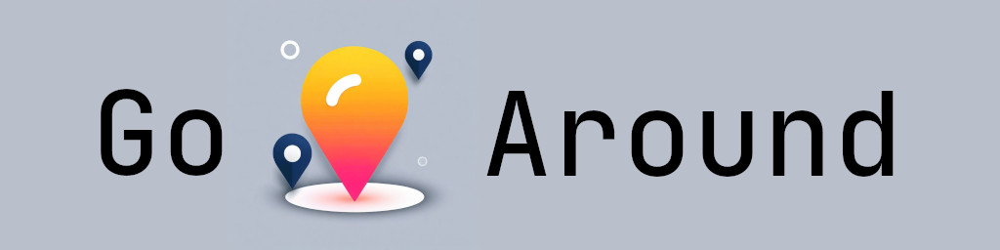

 
 

  
  &nbsp;
  
  &nbsp;

> [!IMPORTANT]
> 📣 The project is only temporarily posted for public access and will be deleted as soon as I finish my winter exams and receive a grade for the relevant subject.

GoAround is a convenient and intuitive service that will help you easily find interesting places nearby. No more spending hours searching for entertainment or places to relax. With GoAround, you will instantly receive a personalized list of establishments according to your preferences

The project actively uses containerization and the image is publicly available: [Container Registry](https://gallery.ecr.aws/l0d9d4c1/go-around/telegram)